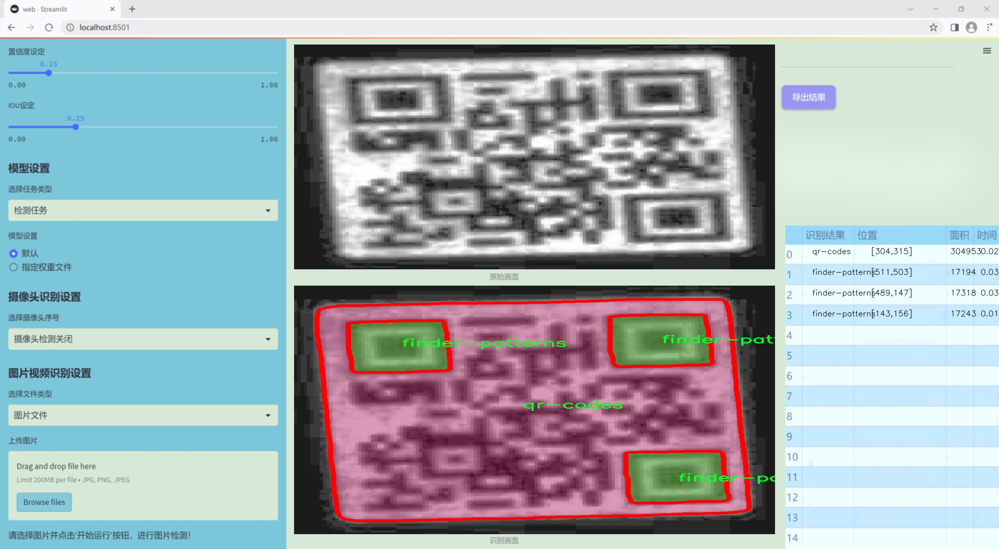
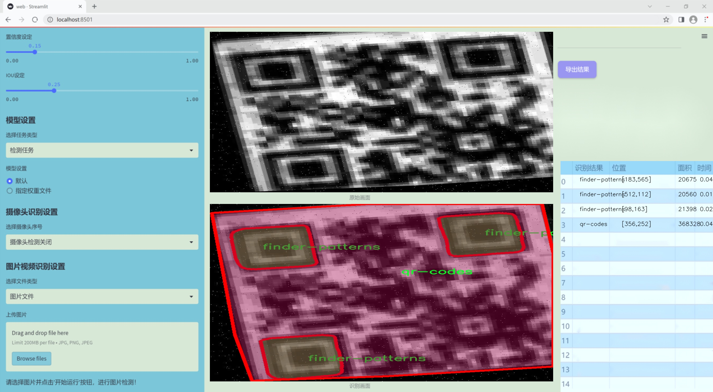
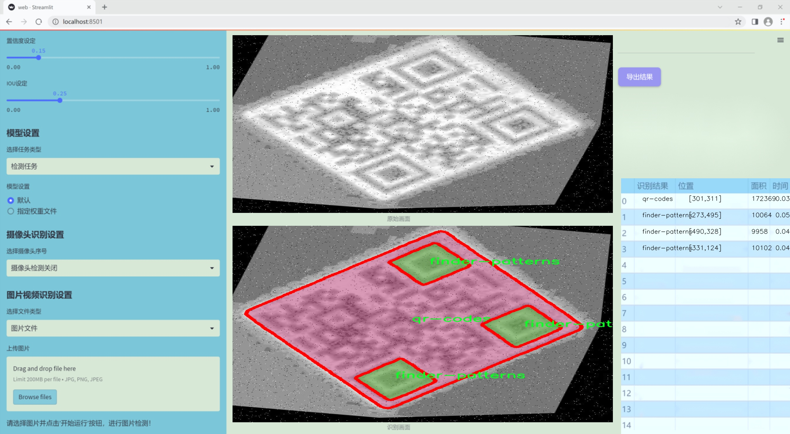
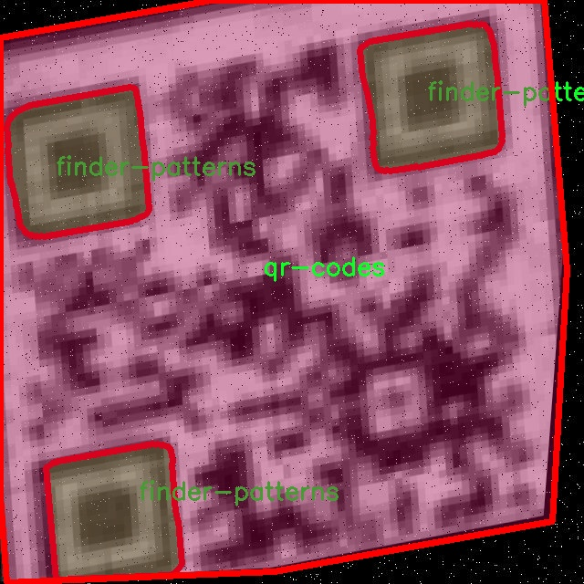
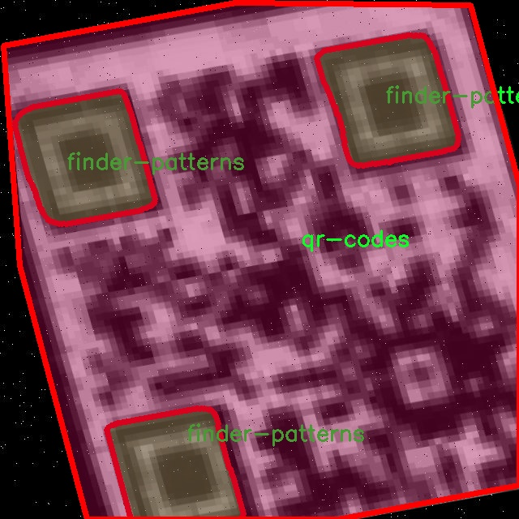
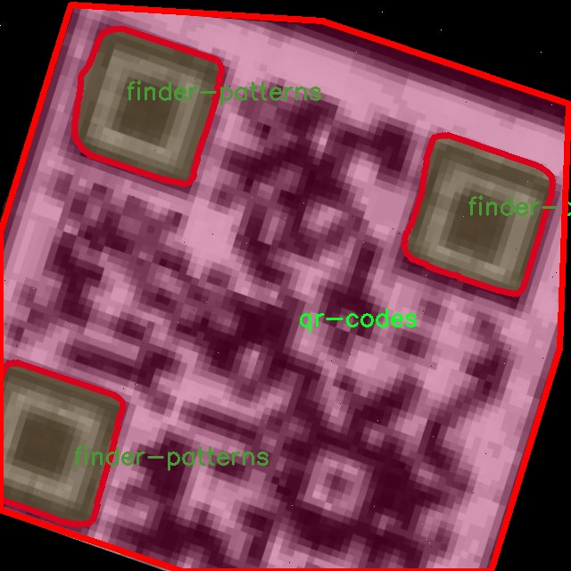
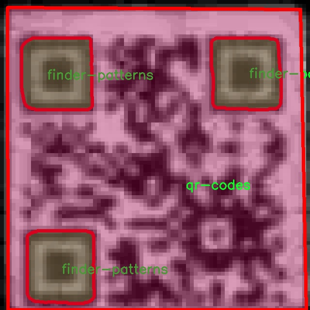
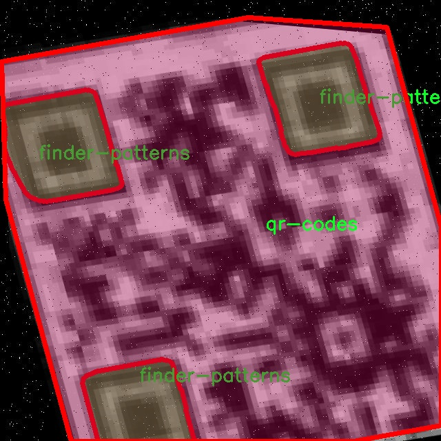

### 1.背景意义

研究背景与意义

随着信息技术的迅猛发展，二维码作为一种高效的信息载体，已广泛应用于商业、物流、医疗等多个领域。二维码的快速识别与解码能力，使其在数据传输、商品追踪及身份验证等方面发挥了重要作用。然而，二维码的有效识别不仅依赖于其清晰度和完整性，还受到环境因素、图像质量以及背景复杂度等多种因素的影响。因此，提升二维码的检测与识别精度，尤其是在复杂场景下的表现，成为了当前计算机视觉领域的重要研究课题。

本研究旨在基于改进的YOLOv11模型，构建一个高效的二维码与查找模式检测系统。通过对现有YOLO系列模型的优化，尤其是在处理实例分割任务方面，期望能够实现对二维码及其查找模式的精准识别。我们使用的数据集包含1300幅图像，涵盖了“finder-patterns”和“qr-codes”两个类别。这一数据集的构建，经过了严格的预处理和数据增强，以确保模型在训练过程中的泛化能力和鲁棒性。

在实际应用中，二维码的检测不仅需要快速响应，还要求在不同光照、角度及背景下保持高准确率。因此，研究二维码的检测技术，尤其是基于深度学习的实例分割方法，将为二维码的广泛应用提供技术支持。同时，该研究也将为其他图像识别任务提供借鉴，推动计算机视觉技术的进一步发展。通过对YOLOv11模型的改进与优化，期望能够为二维码的智能识别与应用提供新的解决方案，促进各行业的数字化转型与智能化升级。

### 2.视频效果

[2.1 视频效果](https://www.bilibili.com/video/BV12qqBYQEsU/)

### 3.图片效果







##### [项目涉及的源码数据来源链接](https://kdocs.cn/l/cszuIiCKVNis)**

注意：本项目提供训练的数据集和训练教程,由于版本持续更新,暂不提供权重文件（best.pt）,请按照6.训练教程进行训练后实现上图演示的效果。

### 4.数据集信息

##### 4.1 本项目数据集类别数＆类别名

nc: 2
names: ['finder-patterns', 'qr-codes']


该项目为【图像分割】数据集，请在【训练教程和Web端加载模型教程（第三步）】这一步的时候按照【图像分割】部分的教程来训练

##### 4.2 本项目数据集信息介绍

本项目数据集信息介绍

本项目旨在改进YOLOv11的二维码与查找模式检测系统，因此所使用的数据集专注于“Finder Pattern Segmentation”这一主题。该数据集包含两大类目标，分别为“finder-patterns”和“qr-codes”，总类别数量为2。这一数据集的构建旨在为算法提供丰富的训练样本，以提高其在实际应用中的识别精度和鲁棒性。

在数据集的构成上，“finder-patterns”类别主要包含各种形状和尺寸的查找模式图案，这些图案通常用于帮助二维码的解码过程。通过对这些查找模式的准确识别，系统能够更好地定位二维码，从而提高解码效率。另一方面，“qr-codes”类别则包含多种类型的二维码样本，这些二维码可能具有不同的内容、版本和纠错级别。通过对这两类目标的联合训练，系统不仅能够有效识别二维码本身，还能准确分离和定位其周围的查找模式。

数据集中的样本经过精心挑选和标注，确保其多样性和代表性，涵盖了不同的环境条件和光照变化。这种多样性使得模型在训练过程中能够学习到更广泛的特征，从而提升其在真实场景中的适应能力。此外，数据集还包含了一些挑战性样本，例如部分遮挡、模糊和低对比度的二维码，这些样本的引入有助于提高模型在复杂情况下的表现。

通过对该数据集的深入分析和应用，我们期望能够显著提升YOLOv11在二维码与查找模式检测任务中的性能，使其在各种实际应用场景中更加高效和可靠。











### 5.全套项目环境部署视频教程（零基础手把手教学）

[5.1 所需软件PyCharm和Anaconda安装教程（第一步）](https://www.bilibili.com/video/BV1BoC1YCEKi/?spm_id_from=333.999.0.0&vd_source=bc9aec86d164b67a7004b996143742dc)


[5.2 安装Python虚拟环境创建和依赖库安装视频教程（第二步）](https://www.bilibili.com/video/BV1ZoC1YCEBw?spm_id_from=333.788.videopod.sections&vd_source=bc9aec86d164b67a7004b996143742dc)

### 6.改进YOLOv11训练教程和Web_UI前端加载模型教程（零基础手把手教学）

[6.1 改进YOLOv11训练教程和Web_UI前端加载模型教程（第三步）](https://www.bilibili.com/video/BV1BoC1YCEhR?spm_id_from=333.788.videopod.sections&vd_source=bc9aec86d164b67a7004b996143742dc)


按照上面的训练视频教程链接加载项目提供的数据集，运行train.py即可开始训练



     Epoch   gpu_mem       box       obj       cls    labels  img_size
     1/200     20.8G   0.01576   0.01955  0.007536        22      1280: 100%|██████████| 849/849 [14:42<00:00,  1.04s/it]
               Class     Images     Labels          P          R     mAP@.5 mAP@.5:.95: 100%|██████████| 213/213 [01:14<00:00,  2.87it/s]
                 all       3395      17314      0.994      0.957      0.0957      0.0843

     Epoch   gpu_mem       box       obj       cls    labels  img_size
     2/200     20.8G   0.01578   0.01923  0.007006        22      1280: 100%|██████████| 849/849 [14:44<00:00,  1.04s/it]
               Class     Images     Labels          P          R     mAP@.5 mAP@.5:.95: 100%|██████████| 213/213 [01:12<00:00,  2.95it/s]
                 all       3395      17314      0.996      0.956      0.0957      0.0845

     Epoch   gpu_mem       box       obj       cls    labels  img_size
     3/200     20.8G   0.01561    0.0191  0.006895        27      1280: 100%|██████████| 849/849 [10:56<00:00,  1.29it/s]
               Class     Images     Labels          P          R     mAP@.5 mAP@.5:.95: 100%|███████   | 187/213 [00:52<00:00,  4.04it/s]
                 all       3395      17314      0.996      0.957      0.0957      0.0845


###### [项目数据集下载链接](https://kdocs.cn/l/cszuIiCKVNis)

### 7.原始YOLOv11算法讲解


ultralytics发布了最新的作品YOLOv11，这一次YOLOv11的变化相对于ultralytics公司的上一代作品YOLOv8变化不是很大的（YOLOv9、YOLOv10均不是ultralytics公司作品），其中改变的位置涉及到C2f变为C3K2，在SPPF后面加了一层类似于注意力机制的C2PSA，还有一个变化大家从yaml文件是看不出来的就是它的检测头内部替换了两个DWConv，以及模型的深度和宽度参数进行了大幅度调整，但是在损失函数方面就没有变化还是采用的CIoU作为边界框回归损失，下面带大家深入理解一下ultralytics最新作品YOLOv11的创新点。

**下图为最近的YOLO系列发布时间线！**


* * *

###### YOLOv11和YOLOv8对比

在YOLOYOLOv5，YOLOv8，和YOLOv11是ultralytics公司作品（ultralytics出品必属精品），下面用一张图片从yaml文件来带大家对比一下YOLOv8和YOLOv11的区别，配置文件变得内容比较少大家可以看一卡，左侧为YOLOv8右侧为YOLOv11，不同的点我用黑线标注了出来。


* * *

###### YOLOv11的网络结构解析

下面的图片为YOLOv11的网络结构图。


**其中主要创新点可以总结如下- > **

* * *

1\.
提出C3k2机制，其中C3k2有参数为c3k，其中在网络的浅层c3k设置为False（下图中可以看到c3k2第二个参数被设置为False，就是对应的c3k参数）。


此时所谓的C3k2就相当于YOLOv8中的C2f，其网络结构为一致的，其中的C3k机制的网络结构图如下图所示
**（为什么叫C3k2，我个人理解是因为C3k的调用时C3k其中的参数N固定设置为2的原因，个人理解不一定对** ）。


* * *

2\.
第二个创新点是提出C2PSA机制，这是一个C2（C2f的前身）机制内部嵌入了一个多头注意力机制，在这个过程中我还发现作者尝试了C2fPSA机制但是估计效果不如C2PSA，有的时候机制有没有效果理论上真的很难解释通，下图为C2PSA机制的原理图，仔细观察把Attention哪里去掉则C2PSA机制就变为了C2所以我上面说C2PSA就是C2里面嵌入了一个PSA机制。


* * *

3\.
第三个创新点可以说是原先的解耦头中的分类检测头增加了两个DWConv，具体的对比大家可以看下面两个图下面的是YOLOv11的解耦头，上面的是YOLOv8的解耦头.


我们上面看到了在分类检测头中YOLOv11插入了两个DWConv这样的做法可以大幅度减少参数量和计算量（原先两个普通的Conv大家要注意到卷积和是由3变为了1的，这是形成了两个深度可分离Conv），大家可能不太理解为什么加入了两个DWConv还能够减少计算量，以及什么是深度可分离Conv，下面我来解释一下。

> **`DWConv` 代表 Depthwise
> Convolution（深度卷积）**，是一种在卷积神经网络中常用的高效卷积操作。它主要用于减少计算复杂度和参数量，尤其在移动端或轻量化网络（如
> MobileNet）中十分常见。
>
> **1\. 标准卷积的计算过程**
>
> 在标准卷积操作中，对于一个输入张量（通常是一个多通道的特征图），卷积核的尺寸是 `(h, w, C_in)`，其中 `h` 和 `w`
> 是卷积核的空间尺寸，`C_in`
> 是输入通道的数量。而卷积核与输入张量做的是完整的卷积运算，每个输出通道都与所有输入通道相连并参与卷积操作，导致计算量比较大。
>
> 标准卷积的计算过程是这样的：
>
>   * 每个输出通道是所有输入通道的组合（加权求和），卷积核在每个位置都会计算与所有输入通道的点积。
>   * 假设有 `C_in` 个输入通道和 `C_out` 个输出通道，那么卷积核的总参数量是 `C_in * C_out * h * w`。
>

>
> 2\. **Depthwise Convolution（DWConv）**
>
> 与标准卷积不同， **深度卷积** 将输入的每个通道单独处理，即 **每个通道都有自己的卷积核进行卷积**
> ，不与其他通道进行交互。它可以被看作是标准卷积的一部分，专注于空间维度上的卷积运算。
>
> **深度卷积的计算过程：**
>
>   * 假设输入张量有 `C_in` 个通道，每个通道会使用一个 `h × w`
> 的卷积核进行卷积操作。这个过程称为“深度卷积”，因为每个通道独立进行卷积运算。
>   * 输出的通道数与输入通道数一致，每个输出通道只和对应的输入通道进行卷积，没有跨通道的组合。
>   * 参数量和计算量相比标准卷积大大减少，卷积核的参数量是 `C_in * h * w`。
>

>
> **深度卷积的优点：**
>
>   1. **计算效率高** ：相对于标准卷积，深度卷积显著减少了计算量。它只处理空间维度上的卷积，不再处理通道间的卷积。
>   2.  **参数量减少** ：由于每个卷积核只对单个通道进行卷积，参数量大幅减少。例如，标准卷积的参数量为 `C_in * C_out * h *
> w`，而深度卷积的参数量为 `C_in * h * w`。
>   3.  **结合点卷积可提升效果** ：为了弥补深度卷积缺乏跨通道信息整合的问题，通常深度卷积后会配合 `1x1` 的点卷积（Pointwise
> Convolution）使用，通过 `1x1` 的卷积核整合跨通道的信息。这种组合被称为 **深度可分离卷积** （Depthwise
> Separable Convolution） | **这也是我们本文YOLOv11中的做法** 。
>

>
> 3\. **深度卷积与标准卷积的区别**
>
> 操作类型| 卷积核大小| 输入通道数| 输出通道数| 参数量  
> ---|---|---|---|---  
> 标准卷积| `h × w`| `C_in`| `C_out`| `C_in * C_out * h * w`  
> 深度卷积（DWConv）| `h × w`| `C_in`| `C_in`| `C_in * h * w`  
>  
> 可以看出，深度卷积在相同的卷积核大小下，参数量减少了约 `C_out` 倍
> （细心的人可以发现用最新版本的ultralytics仓库运行YOLOv8参数量相比于之前的YOLOv8以及大幅度减少了这就是因为检测头改了的原因但是名字还是Detect，所以如果你想继续用YOLOv8发表论文做实验那么不要更新最近的ultralytics仓库）。
>
> **4\. 深度可分离卷积 (Depthwise Separable Convolution)**
>
> 深度卷积常与 `1x1` 的点卷积配合使用，这称为深度可分离卷积。其过程如下：
>
>   1. 先对输入张量进行深度卷积，对每个通道独立进行空间卷积。
>   2. 然后通过 `1x1` 点卷积，对通道维度进行混合，整合不同通道的信息。
>

>
> 这样既可以保证计算量的减少，又可以保持跨通道的信息流动。
>
> 5\. **总结**
>
> `DWConv` 是一种高效的卷积方式，通过单独处理每个通道来减少计算量，结合 `1x1`
> 的点卷积，形成深度可分离卷积，可以在保持网络性能的同时极大地减少模型的计算复杂度和参数量。

**看到这里大家应该明白了为什么加入了两个DWConv还能减少参数量以及YOLOv11的检测头创新点在哪里。**

* * *

##### YOLOv11和YOLOv8还有一个不同的点就是其各个版本的模型（N - S - M- L - X）网络深度和宽度变了


可以看到在深度（depth）和宽度
（width）两个地方YOLOv8和YOLOv11是基本上完全不同了，这里我理解这么做的含义就是模型网络变小了，所以需要加深一些模型的放缩倍数来弥补模型之前丧失的能力从而来达到一个平衡。

> **本章总结：**
> YOLOv11的改进点其实并不多更多的都是一些小的结构上的创新，相对于之前的YOLOv5到YOLOv8的创新，其实YOLOv11的创新点不算多，但是其是ultralytics公司的出品，同时ultralytics仓库的使用量是非常多的（不像YOLOv9和YOLOv10）所以在未来的很长一段时间内其实YOLO系列估计不会再更新了，YOLOv11作为最新的SOTA肯定是十分适合大家来发表论文和创新的。
>

### 8.200+种全套改进YOLOV11创新点原理讲解

#### 8.1 200+种全套改进YOLOV11创新点原理讲解大全

由于篇幅限制，每个创新点的具体原理讲解就不全部展开，具体见下列网址中的改进模块对应项目的技术原理博客网址【Blog】（创新点均为模块化搭建，原理适配YOLOv5~YOLOv11等各种版本）

[改进模块技术原理博客【Blog】网址链接](https://gitee.com/qunmasj/good)


#### 8.2 精选部分改进YOLOV11创新点原理讲解

###### 这里节选部分改进创新点展开原理讲解(完整的改进原理见上图和[改进模块技术原理博客链接](https://gitee.com/qunmasj/good)【如果此小节的图加载失败可以通过CSDN或者Github搜索该博客的标题访问原始博客，原始博客图片显示正常】

### ParC融合位置感知循环卷积简介
ParC：Position aware circular convolution


#### Position aware circular convolution
针对于全局信息的提取作者提出了Position aware circular convolution（也称作Global Circular Convolution）。图中左右实际是对于该操作水平竖直两方向的对称，理解时只看左边即可。对于维度为C*H*W的输入，作者先将维度为C*B*1的Position Embedding通过双线性插值函数F调整到适合input的维度C*H*1（以适应不同特征大小输入），并且将PE水平复制扩展到C*H*W维度与输入特征相加。这里作者将PE直接设置成为了可学习的参数。

接下来参考该博客将加入PE的特征图竖直方向堆叠，并且同样以插值的方式得到了适应输入维度的C*H*1大小的卷积核，进行卷积操作。对于这一步卷积，作者将之称为循环卷积，并给出了一个卷积示意图。


但个人感觉实际上这个示意图只是为了说明为什么叫循环卷积，对于具体的计算细节还是根据公式理解更好。


进一步，作者给出了这一步的伪代码来便于读者对这一卷积的理解：y=F.conv2D（torch.cat（xp，xp，dim=2），kV），实际上就是将xp堆叠之后使用了一个“条形（或柱形）”卷积核进行简单的卷积操作。（但这样会导致多一次重复卷积，因此在堆叠示意图中只取了前2*H-1行）

可以看到在示意图中特征维度变化如下：C*(2H-1)*W ---C*H*1--->C*H*W，作者特意带上了通道数，并且并没有出现通道数的改变，那么这里所进行的卷积应该是depth wise卷积，通过对文章后续以及论文源码的阅读可以得知这一步进行的就是DW卷积。（we introduce group convolution and point wise convolution into these modules, which decreases number of parameters without hurting performance.）


由groups = channel可知使用的是DW卷积
通过上面就完成了一次竖直方向的全局信息交流，同样只要在水平方向进行同样的操作即可做到水平方向的全局信息交流。

#### ParC block

通过ParC成功解决了全局信息提取的问题，接下来就是针对2）3）两点进行改进。首先是Meta-Former模块，Meta-Former由Token Mixer和Channel Mixer构成，ParC首先满足了Token Mixer的全局信息提取的要求，并且相较于Attention在计算成本上更低。


这里①中的PWC即point wise conv，进一步验证了我们前面对于深度可分离卷积的想法，而GCC-H/V即是前面所说的ParC-H/V。

①构建了Meta-Former中的Token mixer模块，那么最后剩下的问题就是3），替换掉Attention模块之后模型不再data driven。为了解决这一点作者给出了一个channel wise attention，先将特征图（x,C*H*W）进行global average（a,C*1*1）并输入一个MLP生成一个channel wise的权重（w,C*1*1），再将权重与特征图在通道方向相乘得到输出（output = wx,C*H*W）。

#### ParC net
对于ParC net 的搭建，作者直接基于MobileViT，采用了分叉结构（c）完成了网络的搭建。


具体而言作者保留了MobileViT中浅层具有局部感受野的MobileNetV2结构，而将网络深层的ViT block替换成了ParC block，使网络变成了一个pure ConvNet。


### 9.系统功能展示

图9.1.系统支持检测结果表格显示

  图9.2.系统支持置信度和IOU阈值手动调节

  图9.3.系统支持自定义加载权重文件best.pt(需要你通过步骤5中训练获得)

  图9.4.系统支持摄像头实时识别

  图9.5.系统支持图片识别

  图9.6.系统支持视频识别

  图9.7.系统支持识别结果文件自动保存

  图9.8.系统支持Excel导出检测结果数据


### 10. YOLOv11核心改进源码讲解

#### 10.1 transformer.py

以下是经过精简和注释的核心代码部分：

```python
import torch
import torch.nn as nn
from functools import partial

# 引入自定义的RepBN和LinearNorm模块
from .prepbn import RepBN, LinearNorm
from ..modules.transformer import TransformerEncoderLayer

# 定义一个LayerNorm和LinearNorm的组合
ln = nn.LayerNorm
linearnorm = partial(LinearNorm, norm1=ln, norm2=RepBN, step=60000)

class TransformerEncoderLayer_RepBN(TransformerEncoderLayer):
    def __init__(self, c1, cm=2048, num_heads=8, dropout=0, act=..., normalize_before=False):
        # 初始化父类TransformerEncoderLayer
        super().__init__(c1, cm, num_heads, dropout, act, normalize_before)
        
        # 使用自定义的线性归一化
        self.norm1 = linearnorm(c1)
        self.norm2 = linearnorm(c1)

class AIFI_RepBN(TransformerEncoderLayer_RepBN):
    """定义AIFI变换器层。"""

    def __init__(self, c1, cm=2048, num_heads=8, dropout=0, act=nn.GELU(), normalize_before=False):
        """使用指定参数初始化AIFI实例。"""
        super().__init__(c1, cm, num_heads, dropout, act, normalize_before)

    def forward(self, x):
        """AIFI变换器层的前向传播。"""
        c, h, w = x.shape[1:]  # 获取输入特征的通道数、高度和宽度
        pos_embed = self.build_2d_sincos_position_embedding(w, h, c)  # 构建位置嵌入
        # 将输入从[B, C, H, W]展平为[B, HxW, C]
        x = super().forward(x.flatten(2).permute(0, 2, 1), pos=pos_embed.to(device=x.device, dtype=x.dtype))
        # 将输出从[B, HxW, C]变换回[B, C, H, W]
        return x.permute(0, 2, 1).view([-1, c, h, w]).contiguous()

    @staticmethod
    def build_2d_sincos_position_embedding(w, h, embed_dim=256, temperature=10000.0):
        """构建2D正弦-余弦位置嵌入。"""
        assert embed_dim % 4 == 0, "嵌入维度必须是4的倍数以适应2D正弦-余弦位置嵌入"
        grid_w = torch.arange(w, dtype=torch.float32)  # 水平网格
        grid_h = torch.arange(h, dtype=torch.float32)  # 垂直网格
        grid_w, grid_h = torch.meshgrid(grid_w, grid_h, indexing="ij")  # 创建网格
        pos_dim = embed_dim // 4  # 每个维度的嵌入维度
        omega = torch.arange(pos_dim, dtype=torch.float32) / pos_dim  # 频率
        omega = 1.0 / (temperature**omega)  # 调整频率

        # 计算正弦和余弦的位置嵌入
        out_w = grid_w.flatten()[..., None] @ omega[None]
        out_h = grid_h.flatten()[..., None] @ omega[None]

        # 返回组合的正弦和余弦嵌入
        return torch.cat([torch.sin(out_w), torch.cos(out_w), torch.sin(out_h), torch.cos(out_h)], 1)[None]
```

### 代码注释说明：
1. **模块导入**：导入必要的PyTorch模块和自定义模块。
2. **归一化定义**：使用`LayerNorm`和`RepBN`组合创建线性归一化的实例。
3. **TransformerEncoderLayer_RepBN类**：继承自`TransformerEncoderLayer`，在初始化中添加了自定义的归一化层。
4. **AIFI_RepBN类**：继承自`TransformerEncoderLayer_RepBN`，实现了特定的前向传播逻辑和位置嵌入构建。
5. **前向传播**：在`forward`方法中，输入数据经过位置嵌入和展平处理后传递给父类的前向方法，最后再变换回原始形状。
6. **位置嵌入构建**：`build_2d_sincos_position_embedding`方法生成2D正弦和余弦位置嵌入，用于增强模型对位置信息的感知。

该文件定义了一个用于Transformer模型的变体，主要涉及自定义的Transformer编码器层和位置嵌入的实现。首先，文件导入了必要的PyTorch库和一些自定义模块，包括RepBN和LinearNorm。这些模块用于实现特定的归一化操作。

接下来，定义了一个名为`TransformerEncoderLayer_RepBN`的类，它继承自`TransformerEncoderLayer`。在其构造函数中，调用了父类的构造函数，并定义了两个归一化层`norm1`和`norm2`，这两个层使用了之前导入的`linearnorm`函数，后者是一个偏函数，结合了LayerNorm和RepBN，且设定了一个步数参数。

然后，定义了`AIFI_RepBN`类，它继承自`TransformerEncoderLayer_RepBN`，并且是一个具体的Transformer层实现。该类的构造函数同样调用了父类的构造函数，并允许用户指定一些参数，如通道数、头数、丢弃率和激活函数等。

在`AIFI_RepBN`类中，重写了`forward`方法，这是前向传播的核心部分。输入`x`的形状为[B, C, H, W]，其中B是批量大小，C是通道数，H和W分别是高度和宽度。首先，调用`build_2d_sincos_position_embedding`方法生成二维的正弦-余弦位置嵌入，然后将输入`x`进行形状变换，展平为[B, HxW, C]的形式，最后将位置嵌入传递给父类的`forward`方法进行处理，最终将输出的形状转换回原来的[B, C, H, W]格式。

`build_2d_sincos_position_embedding`是一个静态方法，用于生成二维的正弦-余弦位置嵌入。该方法首先检查嵌入维度是否能被4整除，这是实现2D位置嵌入的必要条件。接着，通过创建网格坐标，计算出每个位置的正弦和余弦值，并将这些值组合成最终的嵌入。

总体而言，这个文件实现了一个结合了特定归一化方法的Transformer编码器层，并且提供了二维位置嵌入的功能，以适应图像等二维数据的处理需求。

#### 10.2 mobilenetv4.py

以下是保留的核心代码部分，并附上详细的中文注释：

```python
import torch
import torch.nn as nn

# 定义构建卷积层的函数
def conv_2d(inp, oup, kernel_size=3, stride=1, groups=1, bias=False, norm=True, act=True):
    """
    创建一个2D卷积层，包含卷积、批归一化和激活函数（ReLU6）。
    
    Args:
        inp: 输入通道数
        oup: 输出通道数
        kernel_size: 卷积核大小
        stride: 步幅
        groups: 分组卷积的组数
        bias: 是否使用偏置
        norm: 是否使用批归一化
        act: 是否使用激活函数
    
    Returns:
        包含卷积层、批归一化和激活函数的顺序容器
    """
    conv = nn.Sequential()
    padding = (kernel_size - 1) // 2  # 计算填充
    conv.add_module('conv', nn.Conv2d(inp, oup, kernel_size, stride, padding, bias=bias, groups=groups))
    if norm:
        conv.add_module('BatchNorm2d', nn.BatchNorm2d(oup))  # 添加批归一化
    if act:
        conv.add_module('Activation', nn.ReLU6())  # 添加激活函数
    return conv

# 定义反向残差块
class InvertedResidual(nn.Module):
    def __init__(self, inp, oup, stride, expand_ratio, act=False):
        """
        初始化反向残差块
        
        Args:
            inp: 输入通道数
            oup: 输出通道数
            stride: 步幅
            expand_ratio: 扩展比例
            act: 是否使用激活函数
        """
        super(InvertedResidual, self).__init__()
        self.stride = stride
        assert stride in [1, 2]  # 步幅只能是1或2
        hidden_dim = int(round(inp * expand_ratio))  # 计算隐藏层通道数
        self.block = nn.Sequential()
        if expand_ratio != 1:
            self.block.add_module('exp_1x1', conv_2d(inp, hidden_dim, kernel_size=1, stride=1))  # 扩展卷积
        self.block.add_module('conv_3x3', conv_2d(hidden_dim, hidden_dim, kernel_size=3, stride=stride, groups=hidden_dim))  # 深度卷积
        self.block.add_module('red_1x1', conv_2d(hidden_dim, oup, kernel_size=1, stride=1, act=act))  # 投影卷积
        self.use_res_connect = self.stride == 1 and inp == oup  # 判断是否使用残差连接

    def forward(self, x):
        """
        前向传播
        
        Args:
            x: 输入张量
        
        Returns:
            输出张量
        """
        if self.use_res_connect:
            return x + self.block(x)  # 使用残差连接
        else:
            return self.block(x)  # 不使用残差连接

# 定义MobileNetV4模型
class MobileNetV4(nn.Module):
    def __init__(self, model):
        """
        初始化MobileNetV4模型
        
        Args:
            model: 模型类型
        """
        super().__init__()
        self.model = model
        # 根据模型类型构建不同的层
        self.conv0 = conv_2d(3, 32, kernel_size=3, stride=2)  # 初始卷积层
        self.layer1 = InvertedResidual(32, 64, stride=1, expand_ratio=6)  # 第一层反向残差块
        self.layer2 = InvertedResidual(64, 128, stride=2, expand_ratio=6)  # 第二层反向残差块
        # 其他层可以根据需要继续添加

    def forward(self, x):
        """
        前向传播
        
        Args:
            x: 输入张量
        
        Returns:
            输出张量
        """
        x = self.conv0(x)  # 通过初始卷积层
        x = self.layer1(x)  # 通过第一层
        x = self.layer2(x)  # 通过第二层
        return x  # 返回输出

# 创建MobileNetV4ConvSmall模型的函数
def MobileNetV4ConvSmall():
    model = MobileNetV4('MobileNetV4ConvSmall')
    return model

# 主程序
if __name__ == '__main__':
    model = MobileNetV4ConvSmall()  # 创建模型实例
    inputs = torch.randn((1, 3, 640, 640))  # 创建随机输入
    res = model(inputs)  # 通过模型进行前向传播
    print(res.size())  # 输出结果的尺寸
```

### 代码注释说明：
1. **conv_2d函数**：用于创建一个包含卷积、批归一化和激活函数的卷积层。
2. **InvertedResidual类**：实现了反向残差块的结构，包含扩展卷积、深度卷积和投影卷积，并支持残差连接。
3. **MobileNetV4类**：定义了MobileNetV4模型的结构，包括初始卷积层和多个反向残差块。
4. **MobileNetV4ConvSmall函数**：用于创建MobileNetV4ConvSmall模型的实例。
5. **主程序**：创建模型实例并进行前向传播，输出结果的尺寸。

这个程序文件实现了MobileNetV4模型的构建，主要用于深度学习中的图像分类和特征提取。文件中定义了多个不同版本的MobileNetV4模型，包括小型、中型、大型和混合型的结构。

首先，文件导入了必要的库，包括`torch`和`torch.nn`，这些是PyTorch框架的核心组件。接着，定义了一些模型的规格，包括不同层的配置，这些配置以字典的形式存储在`MNV4ConvSmall_BLOCK_SPECS`、`MNV4ConvMedium_BLOCK_SPECS`、`MNV4ConvLarge_BLOCK_SPECS`等变量中。每个规格字典中包含了不同层的名称、块的数量以及具体的块规格（如输入输出通道数、卷积核大小、步幅等）。

接下来，定义了一个`make_divisible`函数，用于确保所有层的通道数都是8的倍数，以便于后续的计算和优化。这个函数接收一个值和一个除数，并根据需要调整值，使其符合可整除的要求。

`conv_2d`函数用于构建一个2D卷积层，包含卷积操作、批归一化和激活函数（ReLU6）。`InvertedResidual`类实现了反向残差块，包含扩展卷积、深度卷积和投影卷积的组合。`UniversalInvertedBottleneckBlock`类则实现了通用的反向瓶颈块，支持不同的卷积核大小和下采样策略。

`build_blocks`函数根据给定的层规格构建相应的层，支持不同类型的块（如`convbn`、`uib`和`fused_ib`）。`MobileNetV4`类是模型的主类，初始化时根据指定的模型类型构建各个层，并将它们组合成一个完整的网络结构。模型的前向传播方法会在输入图像上运行这些层，并根据输入大小提取特征。

最后，文件提供了多个函数（如`MobileNetV4ConvSmall`、`MobileNetV4ConvMedium`等）用于创建不同版本的MobileNetV4模型。在主程序中，创建了一个小型MobileNetV4模型，并对随机生成的输入数据进行了前向传播，输出了各层的特征图尺寸。

整体而言，这个文件提供了一个灵活且可扩展的MobileNetV4实现，适用于各种深度学习任务。

#### 10.3 deconv.py

以下是代码中最核心的部分，并附上详细的中文注释：

```python
import math
import torch
from torch import nn
from einops.layers.torch import Rearrange

# 定义一个二维卷积类，带有特定的权重处理
class Conv2d_cd(nn.Module):
    def __init__(self, in_channels, out_channels, kernel_size=3, stride=1,
                 padding=1, dilation=1, groups=1, bias=False, theta=1.0):
        super(Conv2d_cd, self).__init__() 
        # 初始化卷积层
        self.conv = nn.Conv2d(in_channels, out_channels, kernel_size=kernel_size, stride=stride, padding=padding, dilation=dilation, groups=groups, bias=bias)
        self.theta = theta  # 用于权重调整的参数

    def get_weight(self):
        # 获取卷积层的权重
        conv_weight = self.conv.weight
        conv_shape = conv_weight.shape
        # 重排权重形状
        conv_weight = Rearrange('c_in c_out k1 k2 -> c_in c_out (k1 k2)')(conv_weight)
        # 创建一个新的权重张量
        conv_weight_cd = torch.zeros(conv_shape[0], conv_shape[1], 3 * 3, device=conv_weight.device, dtype=conv_weight.dtype)
        # 将原权重复制到新权重中
        conv_weight_cd[:, :, :] = conv_weight[:, :, :]
        # 调整权重，使其符合特定的卷积操作
        conv_weight_cd[:, :, 4] = conv_weight[:, :, 4] - conv_weight[:, :, :].sum(2)
        # 重排回原来的形状
        conv_weight_cd = Rearrange('c_in c_out (k1 k2) -> c_in c_out k1 k2', k1=conv_shape[2], k2=conv_shape[3])(conv_weight_cd)
        return conv_weight_cd, self.conv.bias  # 返回调整后的权重和偏置


# 定义一个包含多个卷积层的反卷积类
class DEConv(nn.Module):
    def __init__(self, dim):
        super(DEConv, self).__init__()
        # 初始化多个不同类型的卷积层
        self.conv1_1 = Conv2d_cd(dim, dim, 3, bias=True)
        self.conv1_2 = Conv2d_cd(dim, dim, 3, bias=True)  # 这里可以替换为其他卷积类
        self.conv1_3 = Conv2d_cd(dim, dim, 3, bias=True)  # 这里可以替换为其他卷积类
        self.conv1_4 = Conv2d_cd(dim, dim, 3, bias=True)  # 这里可以替换为其他卷积类
        self.conv1_5 = nn.Conv2d(dim, dim, 3, padding=1, bias=True)
        
        self.bn = nn.BatchNorm2d(dim)  # 批归一化层
        self.act = nn.ReLU()  # 激活函数

    def forward(self, x):
        # 前向传播
        w1, b1 = self.conv1_1.get_weight()
        w2, b2 = self.conv1_2.get_weight()
        w3, b3 = self.conv1_3.get_weight()
        w4, b4 = self.conv1_4.get_weight()
        w5, b5 = self.conv1_5.weight, self.conv1_5.bias

        # 将所有卷积层的权重和偏置相加
        w = w1 + w2 + w3 + w4 + w5
        b = b1 + b2 + b3 + b4 + b5
        # 使用合并后的权重和偏置进行卷积操作
        res = nn.functional.conv2d(input=x, weight=w, bias=b, stride=1, padding=1, groups=1)
        
        # 进行批归一化
        res = self.bn(res)
        
        return self.act(res)  # 返回激活后的结果

    def switch_to_deploy(self):
        # 切换到部署模式，合并权重和偏置
        w1, b1 = self.conv1_1.get_weight()
        w2, b2 = self.conv1_2.get_weight()
        w3, b3 = self.conv1_3.get_weight()
        w4, b4 = self.conv1_4.get_weight()
        w5, b5 = self.conv1_5.weight, self.conv1_5.bias

        # 合并权重和偏置
        self.conv1_5.weight = torch.nn.Parameter(w1 + w2 + w3 + w4 + w5)
        self.conv1_5.bias = torch.nn.Parameter(b1 + b2 + b3 + b4 + b5)
        
        # 删除不再需要的卷积层
        del self.conv1_1
        del self.conv1_2
        del self.conv1_3
        del self.conv1_4

# 示例代码，创建模型并进行前向传播
if __name__ == '__main__':
    data = torch.randn((1, 128, 64, 64)).cuda()  # 创建随机输入数据
    model = DEConv(128).cuda()  # 初始化模型
    output1 = model(data)  # 前向传播
    model.switch_to_deploy()  # 切换到部署模式
    output2 = model(data)  # 再次前向传播
    print(torch.allclose(output1, output2))  # 检查输出是否一致
```

### 代码说明：
1. **卷积类**：`Conv2d_cd`类定义了一个卷积层，并提供了一个`get_weight`方法来获取调整后的权重和偏置。
2. **反卷积类**：`DEConv`类包含多个卷积层，并在前向传播中合并这些层的权重和偏置。`switch_to_deploy`方法用于在部署时合并权重，减少计算开销。
3. **前向传播**：在`forward`方法中，使用合并后的权重进行卷积操作，并通过批归一化和激活函数处理输出。
4. **示例代码**：在`__main__`部分，创建了一个输入数据并通过模型进行前向传播，最后检查两次前向传播的输出是否一致。

这个程序文件 `deconv.py` 定义了一些自定义的卷积层和一个名为 `DEConv` 的主模型。以下是对代码的详细说明。

首先，文件导入了必要的库，包括 `math`、`torch` 和 `torch.nn`，以及 `einops` 库中的 `Rearrange` 类用于张量重排。还导入了自定义的 `Conv` 模块和 `fuse_conv_and_bn` 函数。

接下来，定义了多个卷积层类，分别是 `Conv2d_cd`、`Conv2d_ad`、`Conv2d_rd`、`Conv2d_hd` 和 `Conv2d_vd`。这些类都继承自 `nn.Module`，并在初始化时创建了一个标准的二维卷积层 `nn.Conv2d`。每个类都有一个 `get_weight` 方法，用于获取卷积层的权重，并根据特定的逻辑进行处理。

- `Conv2d_cd` 类在 `get_weight` 方法中将卷积权重重排并进行处理，确保权重的某些元素相加为零。
- `Conv2d_ad` 类则在 `get_weight` 方法中对权重进行变换，使用了一个参数 `theta` 来调整权重。
- `Conv2d_rd` 类的 `forward` 方法实现了条件卷积操作，根据 `theta` 的值选择不同的卷积方式。
- `Conv2d_hd` 和 `Conv2d_vd` 类则实现了类似的权重处理逻辑，主要用于处理一维卷积。

然后，定义了 `DEConv` 类，这是一个更复杂的模型。它在初始化时创建了多个自定义卷积层，并定义了一个批归一化层和一个激活函数。`forward` 方法中，模型首先通过各个卷积层获取权重和偏置，然后将它们相加，最后通过 `nn.functional.conv2d` 进行卷积操作。如果存在批归一化层，则对输出进行归一化处理。

`DEConv` 类还定义了一个 `switch_to_deploy` 方法，用于在推理阶段合并卷积层的权重和偏置，以减少计算开销。这个方法将所有卷积层的权重和偏置合并到最后一个卷积层中，并删除不再需要的卷积层。

最后，在 `__main__` 块中，创建了一个随机输入数据，并实例化 `DEConv` 模型。通过模型的 `forward` 方法计算输出，并在调用 `switch_to_deploy` 方法后再次计算输出，最后验证两个输出是否相同。

总体来说，这个文件实现了一种自定义的卷积神经网络结构，提供了多种卷积操作的变体，并在推理阶段优化了计算效率。

#### 10.4 fast_kan_conv.py

以下是代码中最核心的部分，并附上详细的中文注释：

```python
import torch
import torch.nn as nn

class RadialBasisFunction(nn.Module):
    def __init__(self, grid_min: float = -2., grid_max: float = 2., num_grids: int = 8, denominator: float = None):
        super().__init__()
        # 生成一个线性空间，范围从grid_min到grid_max，包含num_grids个点
        grid = torch.linspace(grid_min, grid_max, num_grids)
        # 将生成的grid参数化，不需要梯度更新
        self.grid = torch.nn.Parameter(grid, requires_grad=False)
        # 设置分母，用于控制基函数的平滑度
        self.denominator = denominator or (grid_max - grid_min) / (num_grids - 1)

    def forward(self, x):
        # 计算径向基函数的输出
        # x[..., None]将x的最后一个维度扩展为1，以便与grid进行广播
        return torch.exp(-((x[..., None] - self.grid) / self.denominator) ** 2)

class FastKANConvNDLayer(nn.Module):
    def __init__(self, conv_class, norm_class, input_dim, output_dim, kernel_size, groups=1, padding=0, stride=1, dilation=1, ndim: int = 2, grid_size=8, base_activation=nn.SiLU, grid_range=[-2, 2], dropout=0.0):
        super(FastKANConvNDLayer, self).__init__()
        # 初始化各类参数
        self.inputdim = input_dim
        self.outdim = output_dim
        self.kernel_size = kernel_size
        self.padding = padding
        self.stride = stride
        self.dilation = dilation
        self.groups = groups
        self.ndim = ndim
        self.grid_size = grid_size
        self.base_activation = base_activation()
        self.grid_range = grid_range

        # 验证输入参数的有效性
        if groups <= 0:
            raise ValueError('groups must be a positive integer')
        if input_dim % groups != 0:
            raise ValueError('input_dim must be divisible by groups')
        if output_dim % groups != 0:
            raise ValueError('output_dim must be divisible by groups')

        # 创建基础卷积层和样条卷积层
        self.base_conv = nn.ModuleList([conv_class(input_dim // groups, output_dim // groups, kernel_size, stride, padding, dilation, groups=1, bias=False) for _ in range(groups)])
        self.spline_conv = nn.ModuleList([conv_class(grid_size * input_dim // groups, output_dim // groups, kernel_size, stride, padding, dilation, groups=1, bias=False) for _ in range(groups)])
        self.layer_norm = nn.ModuleList([norm_class(output_dim // groups) for _ in range(groups)])

        # 初始化径向基函数
        self.rbf = RadialBasisFunction(grid_range[0], grid_range[1], grid_size)

        # 初始化dropout层
        self.dropout = None
        if dropout > 0:
            if ndim == 1:
                self.dropout = nn.Dropout1d(p=dropout)
            if ndim == 2:
                self.dropout = nn.Dropout2d(p=dropout)
            if ndim == 3:
                self.dropout = nn.Dropout3d(p=dropout)

        # 使用Kaiming均匀分布初始化卷积层的权重
        for conv_layer in self.base_conv:
            nn.init.kaiming_uniform_(conv_layer.weight, nonlinearity='linear')
        for conv_layer in self.spline_conv:
            nn.init.kaiming_uniform_(conv_layer.weight, nonlinearity='linear')

    def forward_fast_kan(self, x, group_index):
        # 对输入应用基础激活函数，并进行线性变换
        base_output = self.base_conv[group_index](self.base_activation(x))
        if self.dropout is not None:
            x = self.dropout(x)
        # 计算样条基函数
        spline_basis = self.rbf(self.layer_norm[group_index](x))
        spline_basis = spline_basis.moveaxis(-1, 2).flatten(1, 2)  # 调整维度以适应卷积
        spline_output = self.spline_conv[group_index](spline_basis)
        # 将基础输出和样条输出相加
        x = base_output + spline_output
        return x

    def forward(self, x):
        # 将输入按组拆分
        split_x = torch.split(x, self.inputdim // self.groups, dim=1)
        output = []
        for group_ind, _x in enumerate(split_x):
            y = self.forward_fast_kan(_x.clone(), group_ind)
            output.append(y.clone())
        # 将所有组的输出拼接在一起
        y = torch.cat(output, dim=1)
        return y
```

### 代码说明：
1. **RadialBasisFunction**：实现了一个径向基函数，输入一个张量`x`，输出基于`grid`的高斯型函数值。
2. **FastKANConvNDLayer**：这是一个通用的卷积层实现，支持多维卷积（1D, 2D, 3D），包括基础卷积和样条卷积。它会对输入进行分组处理，并在每个组上应用不同的卷积和归一化操作。
3. **forward_fast_kan**：这是该层的前向传播函数，计算基础卷积和样条卷积的输出，并将它们相加。
4. **forward**：对输入进行分组处理，并对每个组调用`forward_fast_kan`，最后将所有组的输出拼接在一起。

这个程序文件定义了一个用于快速卷积神经网络的模块，主要包括了径向基函数（Radial Basis Function）和一个多维卷积层（FastKANConvNDLayer），以及针对一维、二维和三维卷积的具体实现类。

首先，`RadialBasisFunction`类是一个自定义的神经网络模块，主要用于生成径向基函数。它的构造函数接受一些参数，包括网格的最小值和最大值、网格的数量以及分母的值。网格是通过`torch.linspace`生成的，并被定义为一个不可训练的参数。`forward`方法则实现了径向基函数的计算，返回一个基于输入`x`和网格的输出。

接下来，`FastKANConvNDLayer`类是一个多维卷积层的实现，支持不同维度的卷积操作。它的构造函数接受多个参数，包括输入和输出维度、卷积核大小、分组数、填充、步幅、扩张、网格大小、基础激活函数、网格范围和丢弃率等。构造函数中会检查分组数的有效性，并确保输入和输出维度能够被分组数整除。该类内部创建了基础卷积层、样条卷积层和层归一化层，并初始化权重。`forward_fast_kan`方法实现了快速KAN卷积的前向传播逻辑，先通过基础卷积和激活函数处理输入，然后通过样条基函数进行处理，最后将两者的输出相加。`forward`方法则将输入按照分组进行拆分，并对每个分组调用`forward_fast_kan`进行处理，最后将结果拼接成输出。

此外，`FastKANConv3DLayer`、`FastKANConv2DLayer`和`FastKANConv1DLayer`类分别继承自`FastKANConvNDLayer`，并针对三维、二维和一维卷积进行了具体实现。它们在构造函数中指定了相应的卷积和归一化类（如`nn.Conv3d`、`nn.Conv2d`和`nn.Conv1d`），以便于使用不同维度的卷积操作。

整体而言，这个程序文件实现了一个灵活且高效的卷积神经网络模块，能够处理多维数据，并通过径向基函数和样条卷积增强模型的表达能力。

### 11.完整训练+Web前端界面+200+种全套创新点源码、数据集获取


# [下载链接：https://mbd.pub/o/bread/Z5yZmplp](https://mbd.pub/o/bread/Z5yZmplp)